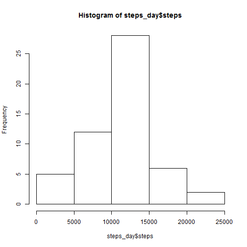

# Reproducible Research: Peer Assessment 1
  

## Loading and preprocessing the data
Access downloaded data set


```r
file <- "activity.zip"
unzip (file)
file <- "activity.csv"

activityData <- read.csv (file, ) 
```

## What is mean total number of steps taken per day?
calculate the steps per day


```r
steps_day <- aggregate  (steps~date, data=activityData, FUN="sum")
```

histogram of steps per day

```r
hist(steps_day$steps)
```

 

calculate mean and median

```r
mean(steps_day$steps)  
```

```
## [1] 10766
```

```r
median(steps_day$steps)
```

```
## [1] 10765
```


## What is the average daily activity pattern?
Aggregate the data against the intervals.
Then create a histogram plot for this.

```r
steps_int <- aggregate (steps~interval, data=activityData, FUN ="mean")
plot (steps ~ interval, data=steps_int, type ='l')
```

 

What interval contains the maximum number of steps (averaged over all days)?


```r
steps_int [steps_int$steps==max (steps_int$steps), ]
```

```
##     interval steps
## 104      835 206.2
```


## Imputing missing values
Total number of rows with NA can be calculated in different ways.

Here we use the complete.cases function and return the number of rows with missing data as FALSE and complete rows as TRUE

```r
comp_dat <- complete.cases(activityData)
table(comp_dat)
```

```
## comp_dat
## FALSE  TRUE 
##  2304 15264
```


## Are there differences in activity patterns between weekdays and weekends?
